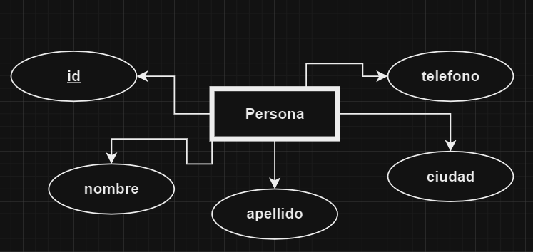

# Introducción a MySQL

 *SQL: Structured Query Language
 ES el lenguaje que usan las bases de datos relacionales.*

---
Se ha convertido en un estandar internacional de manejo de SGBD: MySQL, PostgreSQL, Oracle, MariaDB, SQLServer, etc...
---

SQL nos permite realizar distinata operaciones y consultas a bases de datos, tales como:

* Crear (registros, tablas, etc)
* Modificar
* Leer
* Insertar
* Eliminar

Nota: CRUD (Create, Read, Update, Delete)

> SQL se subdivide en varios sublenguajes:

1. DDL (Data Definition Language): Define las entidades modeladas.
2. DML (Data Manipulation Language): Consultar y modificar datos.
3. DQL: (Data Query Language): Su excelencia es consultar datos.
4. DCL: (Data Control Language): Nos permite administrar permisos y accesos.

> DDL: Data Definition Language

Los comandos básicos son: 

* CREATE: permite crear bases de datos, tablas y vistas.
* ALTER: permite modificar una tabla.
* DROP: permite eliminar bases de datos, tablas o columnas. (TENER CUIDADO)
---

¿Como crear una base de datos?

```
    CREATE SCHEMA 'nombre_bd';
```

¿Como usar una base de datos?
```
    USE 'nombre_bd';
```

Diagrama de la entidad: 

¿Como crear una entidad?
```
    CREATE TABLE persona(
        id INT AUTO_INCREMENT,
        nombre VARCHAR(45),
        apellido VARCHAR(45),
        ciudad VARCHAR(45),
        telefono VARCHAR(45),
        PRIMARY KEY(`id`)
    );
```

¿Como agregar una columna a una tabla existente?
```
    ALTER TABLE persona
    ADD COLUMN fecha_nacimiento
    DATETIME NULL AFTER ciudad;
```

¿Como eliminar una columna de una tabla existente?
```
    ALTER TABLE persona
    DROP COLUMN fecha_nacimiento;
```

¿Como podemos cambiar el nombre y el tipo de dato de una columna de una tabla?
```
    ALTER TABLE persona
    CHANGE apellido apellido_paterno VARCHAR(45);
```

¿Como cancelar la ejecución de un comando?
Atajo de teclado: ctrl + c

*Vistas: es una consulta personalizada que se crea para no tener que escribir el query cada que vez que se desea ejecutar.*

Nota: para poder crear una vista lo ideal es que tenga algunos registros la tabla a consultar.

> DML: Data Manipulation Language

Sus comandos básicos son:
* SELECT: Selecciona los campos a consultar.
* INSERT: Insertando registros en los campos seleccionados.
* UPDATE: Modifica algunos valores de campos de registros ya existentes.
* DELETE: Eliminar registros de una tabla.

¿Como insertar datos en una tabla?
Generalmente a esto se le llama registros.

Usamos el comando INSERT:
```
    INSERT INTO persona(nombre,apellido_paterno,ciudad,telefono) VALUES ('Ana','Gómez','Monterrey','5601928374');
```
Nota: el 'id' no es necesario considerarlo ya que se genera en automatico.

¿Como podemos insertar multiples registros en una tabla?
```
    INSERT INTO persona (nombre,apellido_paterno,ciudad,telefono) VALUES
    ('Raul','Pérez','CDMX','5512341234'),
    ('Laura','López','Guadalajara','5601992288'),
    ('Carlos','Martinez','Queretaro','7781726354');
```

¿Como podemos modificar un valor de un campo en un registro?
Usando el comando UPDATE
```
    UPDATE persona
    SET ciudad = 'CDMX'
    WHERE id=3;
```

¿Como eliminamos un registro de una tabla?
Nota: tener cuidado de como aplicar este comando porque se podrían borrar todos los registros.
```
    DELETE FROM persona
    WHERE id = 4;
```

> DQL: Data Query Language
Se usa para realizar consultas y recuperación de información de la base de datos (registros).

¿Como consultar todos los registros de una tabla?
Usando el comando SELECT
```
    SELECT * FROM persona;
```

¿Como podemos consultar solamente algunos campos de una tabla?
```
    SELECT nombre,telefono FROM persona;
```

¿Como podemos consultar solamente algunos registros de una tabla?
```
    SELECT * FROM persona
    WHERE id >= 3;
```

¿Como podemos consultar solamente algunos campos y algunos registros de una tabla?
```
    SELECT id,nombre
    FROM persona
    WHERE id >= 3;
```

Nota final:
SELECT delimita las columnas
FROM selecciona la tabla
WHERE delimita los registros bajo una condición

*Extra: MySQL nos permite usar un conjunto de funciones que sirven para obtener datos sobre los datos.* Ejemplo: COUNT(*)

¿Como podemos contar todos los registros de una tabla?

```
    SELECT COUNT(*) AS total_personas
    FROM persona;
```

Exiten otras funciones como: SUM,AVG,etc...

> DCL: Data Control Language
Se usa para gestionar permisos y privilegios en 
una base de datos.

Sus comandos principales son:

* GRANT: conceder permisos a usuarios o roles sobre ciertos objetos de una BD.
* REVOKE: quita los permisos previamente concedidos.

> Proyecto blog desde Workbench

TODO: Diseño (diagramas entidad-relación) y creación de la base de datos 'mi_blog' desde workbench, usando llaves primarias y foraneas. Creando registros en las tablas.

> Consultas con MySQL:

¿Como podemos consultar registros anteriores a un año especifico?

```
    SELECT * 
    FROM publicaciones 
    WHERE fecha<'2023';
```

¿Cómo podemos consultar registros que tienen una fecha especifica?

```
    SELECT *
    FROM publicaciones
    WHERE fecha = '2024-06-01';
```

¿Cómo podemos traer sólo algunos campos de un registro? (Recordatorio)

```
    SELECT titulo,fecha 
    FROM publicaciones;
```

¿Cómo podemos traer sólo algunos campos de un registro y renombrarlos?

```
    SELECT 
        titulo AS encabezado, 
        fecha AS fecha_publicación 
    FROM 
        publicaciones;
```

Nota: éste último query simplemente cambia la forma en que se muestran los nombres de las columnas en los resultados de la consulta, pero no altera la estructura de la tabla ni los nombres reales de las columnas en la base de datos.

¿Cómo podemos contar el total de registros de una tabla y además renombrar el resultado?

```
    SELECT COUNT(*) 
    AS cantidad_publicaciones 
    FROM publicaciones;

```

ACTIVIDAD: Hacer 3 consultas a la base de datos 'mi_blog' a la tabla categorias.

1. Una que imprima todas las categorias.
2. Una que cuente cuantas categorías hay.
3. Una que cambie el nombre de la columna 'categoria'.

¿Cómo podemos poner comentarios en Workbench?
```sql
-- Este es un comentario de una sola línea

/*
   Comentarios 
   que nos 
   permite
   escribir
   en varias 
   líneas....
*/
```

TODO: La explicación de JOIN queda pendiente.

> Proyecto 'Punto_de_venta'

TODO: Se implementa la explicación del proyecto
'punto_de_venta'.

_Un punto de venta (POS) es el lugar físico o virtual donde se realizan transacciones comerciales. En un contexto físico, el POS es el lugar donde los clientes pagan por bienes o servicios, como tiendas o restaurantes. En un contexto virtual, el POS se refiere al software y hardware utilizados para procesar pagos en línea. El sistema POS incluye dispositivos como cajas registradoras, terminales de pago y software de gestión de ventas, facilitando no solo las transacciones, sino también otras funciones comerciales como la gestión de inventario y clientes._

*Pasos para crear el punto de venta:*

1. Definir los requisitos del sistema.
* Producto (tabla)
* Administrador (tabla)
* Vendedor (tabla)
* Carrito
* Ticket

2. Diseño de la base de datos.
* Hacer diagramas de entidades
* Crear la base de datos en Workbench
* Ponerle algunos registros

3. Configurar la conexión a la base de datos.
* Crear la conexión usando la JDBC

4. Diseñar los modelos de la lógica de negocio. (Diagramas UML y clases java).
    1. Producto (tabla)
    2. Administrador (tabla)
    3. Vendedor (tabla)
    4. Carrito
    5. Ticket

5. Crear un sistema de repositorio que integre las funciones de un CRUD.

6. Hacer un Test de las funciones del repositorio.

7. Hacer un diseño (wireframes) de las vistas de la aplicación.

8. Crear la GUI con un asistente de diseño.

9. Realizar pruebas.

