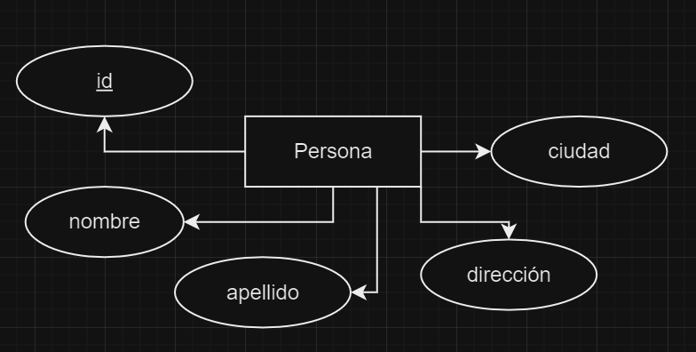

### Introducción a SQL

*SQL: Structured Query Language*
Es el lenguaje que usan las base de datos relacionales.

---
Se ha convertido en un estandar internacional
de manejo de SGBD: MySQL, PostgreSQL, Oracle, SQLserver,etc...
---

SQL nos permite realizar diversas operaciones y consultas
a bases de datos, tales como:
* Crear (registros,tablas,etc)
* Modificar
* Leer
* Insertar
* Eliminar

Nota: CRUD (Create,Read,Update,Delete)

> SQL se subdivide en varios sublenguajes:
1. DDL (Data Definition Language): Define las entidades modeladas.
2. DML (Data Manipulation Language): Consultar y modificar datos.
3. DQL (Data Query Language): Su excelencia es consultar datos.
4. DCL (Data Control Language): Nos permite administrar permisos o acceso.

> DDL: Data Definition Language

Los comandos básicos son:
* CREATE: permite crear bases de datos, tablas y vistas.
* ALTER: Modificar tablas.
* DROP: Eliminar las bases de datos. (Tener mucho cuidado)
---

¿Como crear una BD?
```
   CREATE SCHEMA `nombre_bd`;  
```

¿Como usar una base de datos?
```
    USE `nombre_bd`;
```

Diagrama de una entidad:

¿Como creamos esta entidad?
```
    CREATE TABLE persona(
        id INT AUTO_INCREMENT,
        nombre VARCHAR(45),
        apellido VARCHAR(45),
        dirección VARCHAR(45),
        ciudad VARCHAR(45),
        PRIMARY KEY(`id`)
    );
```

¿Como agregar una columna a una tabla existente?
```
    ALTER TABLE persona
    ADD COLUMN fecha_nacimiento
    DATETIME NULL AFTER ciudad;
```

¿Como eliminar una columna de una tabla?
```
    ALTER TABLE persona
    DROP COLUMN fecha_nacimiento;
```

¿Como podemos cambiar el nombre y tipo de dato a una tabla?
```
    ALTER TABLE persona
    CHANGE apellido apellido_pat VARCHAR(45);
```

¿Como cancelar la ejecución de un comando?
Atajo: ctrl + c

*Vistas: es una consulta personalizada que se 
crea para no tener que escribir el query cada
vez que se desea ejecutar.*

Nota: para poder crear una vista lo ideal es que
existan algunos registros en la tabla a consultar.

> DML: Data Manipulation Language

Sus comandos básicos son: 
* SELECT: Selecciona los campos a consultar.
* INSERT: Inserta registros en los campos respectivos.
* UPDATE: Modifica algunos valores de datos de campos ya existentes.
* DELETE: Eliminar registros de una tabla. (Tener cuidado)

¿Como insertar datos de un registro?


